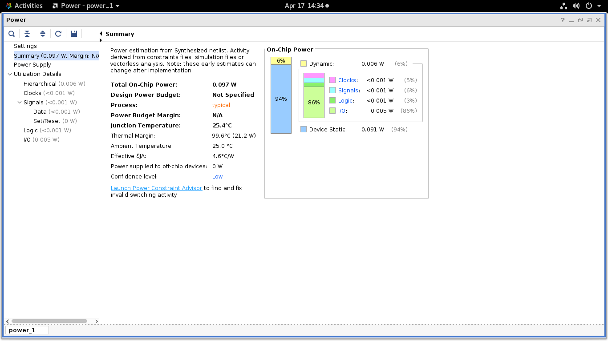
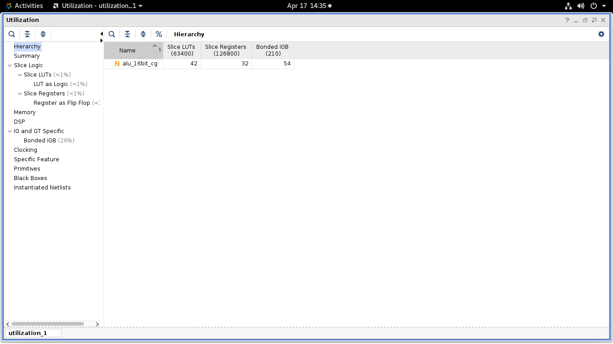
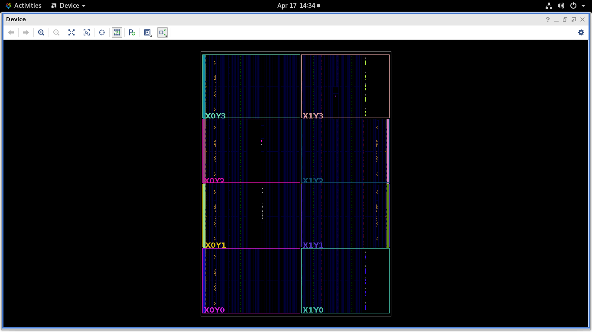
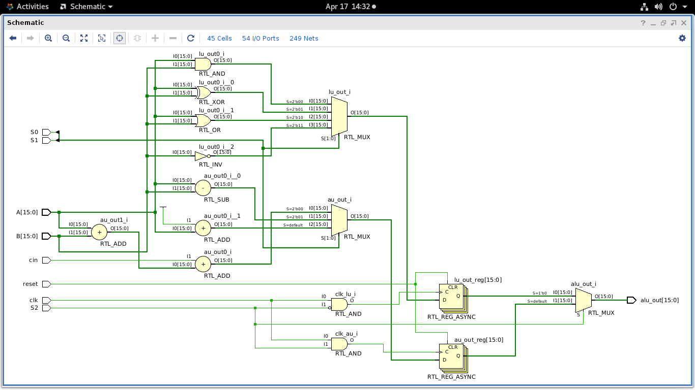

# 🔧 16-bit ALU Design using Clock Gating

## 📌 Project Overview

This project implements a **16-bit Arithmetic Logic Unit (ALU)** optimized for **low power consumption** using the **clock gating technique**. The design is implemented using **Verilog HDL** and synthesized in **Xilinx Vivado**.

---

## 🎯 Objectives

* Design a 16-bit ALU
* Reduce **dynamic power consumption**
* Optimize **area and performance**
* Implement **clock gating** for efficiency

---

## 🛠️ Tools & Technologies

* Verilog HDL
* Xilinx Vivado
* FPGA 

---

## ⚙️ Features

* Arithmetic Operations: Addition, Subtraction, Increment, Decrement
* Logic Operations: AND, OR, XOR, NOT
* Clock Gating for power reduction
* 16-bit input/output support

---

## 📊 Results

### 🔹 Power Report

* Total Power: **0.097 W**
* Dynamic Power: **0.006 W**
* Static Power: **0.091 W**

---

### 🔹 Area / Utilization Report

* Slice LUTs: **42**
* Registers: **32**
* IOBs: **54**

---

### 🔹 Device Layout

---

### 🔹 Schematic

---

## 💡 Key Concept

Clock gating reduces power by disabling inactive modules, minimizing unnecessary switching activity.

---

## 📁 Project Files

* `alu_16bit_cg.v` → Main ALU design
* Reports & screenshots → Performance analysis

---

## 🚀 Conclusion

The implementation successfully reduces **dynamic power consumption** while maintaining performance, making it suitable for **low-power applications**.

---

## 👨‍💻 Author

harshit joshi , ayush rajak 
